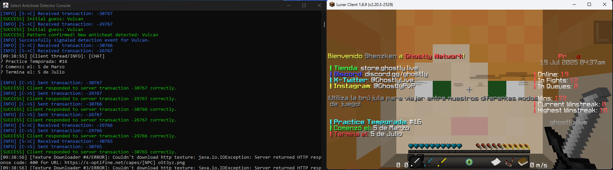

**Anticheat Detector is a program for Minecraft: Java Edition (version 1.8.9) designed to heuristically infer which anticheat a Minecraft server is running by injecting server and client responses.**

*If you want to know about how this whole project was developed, head to this [file](https://github.com/NotRequiem/Anticheat-Detector/blob/master/xd.md).*

This program has the ability to:
> __1.__ Dynamically intercept, re-instrument and recompile Java methods for JNI bridge hooking

> __2.__ Attach to any JVM version in a thread-safe manner to load global JVMTI events that will intercept every JIT compilation of classes at real time, specifically onClassPrepare and onClassFileLoadHook

> __3.__ Debug the current Minecraft game without actually creating OS debugging ports, redirecting all the streams to a new spawned console, allowing you to see internal client logs of every kind

> __4.__ Queue and test the transactions that you send to a Minecraft server for anticheat development or network testing purposes

> __5.__ Parse and walk every kind of information about classes despite being inlined, protected or optimized away by the JVM, such as native method names, descriptors, index, references, superclasses, field references, methods, major and minor version, constant pools, exception table entries, stack memory maps, attributes, locals and class signatures

> __6.__ Downgrade the class version, reserialize or deoptimize any Java class at real-time despite the JVM being in debug mode or not, as well as performing raw bytecode instrumentation based on the attached JVM without using external java agents or modifying virtual machine arguments at launch time

> __7.__ Establish public IPC channels via events and file mapping objects that anybody can listen for anticheat detection

> __8.__ Perform with minimum overhead, allowing to use and play the game and go back to the console whenever you're curious about what anticheat a server is using. 

> __9.__ Work without administrator privileges or token escalation

> __10.__ Log and print client and server responses to Minecraft anticheats. Anticheat detections will be notified to **both the injector and the DLL**

# Components
1. The injector, this is the main agent responsible for detecting the game instance in your system, injecting into Minecraft's address space, starting the anticheat detection module remotely, and establishing an inter-process communication channel with it via virtual shared memory.
2. The anticheat detection module, which reverse engineers network packets to detect the presence of an anticheat.

# How does it work?
1. Firstly, injector.exe is ran and guides the user into what to do to inject the module. Once injected, it will wait 5 seconds for the module to signal an event to the injector, confirming successful injection.

2. Once Minecraft is started and the DLL is injected, the anticheat module will start hooking the creation of every class and debugging the game while ensuring the JVM doesn't throw unhandled exceptions due to this 'massive' interception.

3. When the player clicks on the "Multiplayer" button, the JVM will attempt to load the required networking classes to connect you to a minecraft server, which the module will intercept to inject it's own callback method in order to analyze transactions.

4. When a player joins on a server that is running an anticheat, the module will automatically detect the presence of it and start guessing the name of it.

5. If the module is able to recognize the anticheat, it will contact injector.exe to send a message indicating what anticheat is the server running. If a player reconnects to another server, the module will instantly detect the switch and start debugging a new session to determine the new anticheat running in that server.

# How to build?
If you want build the project yourself rather than installing the binaries on the [Releases](https://github.com/NotRequiem/Anticheat Detector/releases/) section, you simply have to download the project, open the 'Anticheat Detection.sln' file with Visual Studio, change the mode to "Release" and click on "Build Solution", it's literally that simple as no other external tools like Spectre mitigations or Clang were used.

**It's not advised to modify the compiler settings**, which are optimized for maximum speed and to ensure correct linkage with JNI/JVMTI libraries, creating C++ exports on compilation that Java will call, and assembling control flow guards to prevent some Minecraft clients from dettaching the module.

However, there should be no problem, after further testing I didn't notice any unhandled exception or performance issues when building the code with other compilers or flags.

# The Idea
Transaction packets are synchronous packets like the rest of data sent by Minecraft **Java** (except keep alives which are the only exception to this TCP-like protocol) that usually get sent by the anticheats to handle latency. Every transaction has an id, once the client receives the packet by the anticheat (`S32PacketConfirmTransaction`), the client replies with `C0FPacketTransaction`; a server bound transaction with the same id. 

By using transactions, the anticheat can know if a packet has for certain reached the client and when. They're used to detect cheat modules like reach and velocity, or for world/inventory compensation.
Almost every anticheat has its unique way of sending those transactions that are the pillar of modern anticheat detection, which means they can be abused to fingerprint an anticheat. This simple and known approach is what the module abuses to create patterns that attempt to detect the unique randomization of every anticheat.

# Anticheat Detection List
*The module focuses only on the most user anticheats on the Java market, excluding anticheats that do not send transactions (NCP), anticheats that are heavily outdated (Buzz, Grim, Matrix, AAC, etc...), anticheats that are known to only be present in one specific server (for example, Hypixel's Watchdog), or anticheats mainly optimized for Bedrock to my knowledge (Astro).*

```
1. Polar - jk, i love Lucky :)
2. Intave - based on old available information as I can't figure out any server running Intave right now
3. Verus
4. Vulcan
5. Grim
6. AGC - only present in MMC nowadays, however leaked versions of it used to be used on Invaded and are still running on some cracked servers
```

`Some examples:`
<p align="center">

</p>

<p align="center">

</p>

<p align="center">

</p>

# Notes and Legal
The module was only developed for 1.8.9 because I don't really need to support every Minecraft version, just one is more than enough for a just one-time "What's the anticheat of this server", which would be a pain by the way.

Antivirus detections may flag `injector.exe` due to its ability to allocate virtual memory in external processes.

The module was only tested in Lunar Client (i'm lazy to download other stuff) and it's currently in Beta. Nevertheless, feel completely free to open any issue requesting more features like detections for other anticheats, or unexpected bugs.

I am not responsible nor liable for any damage you cause through any malicious usage of this project.

License: MIT
